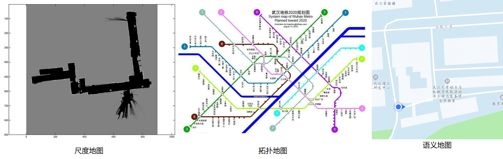
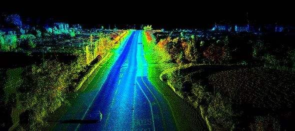
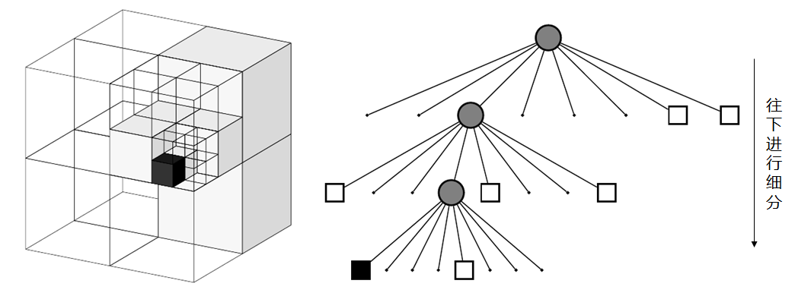
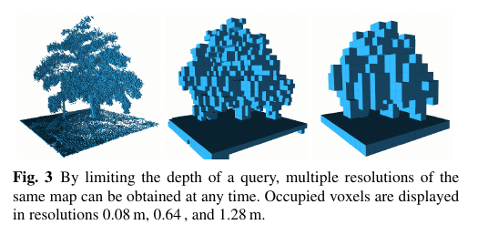

# Pre-requirement | 移动机器人中的地图

地图有很多种表示形式，在移动机器人中比较常用的是尺度地图、拓扑地图、语义地图

- **尺度地图**：具有真实的物理尺度，如栅格地图、点云地图，常用于SLAM、小场景路径规划
- **拓扑地图**：只包含不同位置的连通关系和距离，不具备真实的物理尺度，常用于大规模的机器人路径规划
- **语义地图**：在尺度地图上添加标签，常用于人机交互

我们平时接触比较多的应该是语义地图，对于人类来说，根据语义地图移动到目的地是轻而易举的，但是对机器人来说却相当困难，它不能像人类一样”理解“地图，而是要用**程序**处理地图数据。一个程序无外乎两个组成：数据结构、算法，用不同的数据结构来表示地图，就会得到不同的地图形式

本专栏主要针对**小场景的运动规划**，下面将介绍几种常用的尺度地图

### Occupancy Grid Map 占据栅格地图

计算机中任何数据都是离散的。在空间中连续的地图，在计算机中也是由一个个离散的数据组成的。我们将地图栅格化，每个栅格只有三个状态：占据、空闲、未知。

能够直接使用索引进行查询

内存占用大

PGM地图

**PGM**是Portable Gray Map的缩写。它是**灰度图像格式**中一种最简单的格式标准。

### Point cloud map 点云地图

### Octo-map 八叉树地图

点云地图通常规模很大，而且它是无序的，无法通过索引进行查询

八叉树(octree)就是有八个子节点的树，是一种递归、轴对齐且空间间隔的数据结构，常用于3D数据的表达。

假设某个空间是一个立方体，这个立方体中有一个小障碍物，我们可以直接将这个立方体标记为占用状态，很显然这种方式太粗糙了，我们需要一种**更精细**的方法。将立方体分成很多个符合精度要求的小立方体，然后对障碍物所在的小立方体进行标记，这是一种方法，但是占用内存太大，很多空闲状态的立方体并不需要专门分配内存进行标记。

那么如何兼顾**精度**和**内存**呢？这时候就该祭出八叉树结构了。

可以将这个立方体分成八个小立方体，对包含障碍物的立方体继续进行分割，直到达到我们想要的精度为止。**当某个节点的所有子节点都是占据、空闲或者未知状态时，我们可以将它和它的子节点全部剪掉**，这样可以极大的减少占用的内存空间

不能直接使用索引进行查询，按照树的结构进行递归查询

稀疏的，占用内存小

### Voxel Hashing

### TSDF Map

### 参考

[古月居：占据栅格地图构建](https://www.guyuehome.com/14968)

[SLAM拾萃(1)：octomap](https://www.cnblogs.com/gaoxiang12/p/5041142.html)

[高效八叉树octree：基于hash函数的数据结构](https://blog.csdn.net/qq_28660035/article/details/80388932)