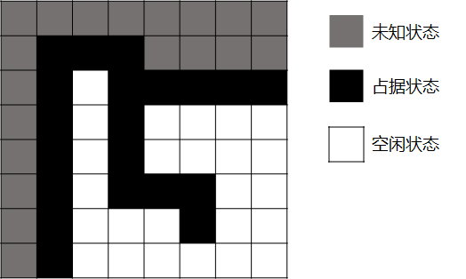
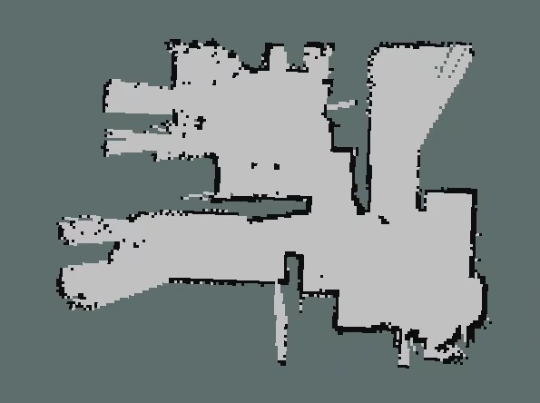

# Pre-requirement | 移动机器人中的地图

地图有很多种表示形式，在移动机器人中比较常用的是尺度地图、拓扑地图、语义地图

- **尺度地图**：具有真实的物理尺度，如栅格地图、点云地图，常用于SLAM、小场景路径规划
- **拓扑地图**：只包含不同位置的连通关系和距离，不具备真实的物理尺度，常用于大规模的机器人路径规划
- **语义地图**：在尺度地图上添加标签，常用于人机交互

我们平时接触比较多的应该是语义地图，对于人类来说，根据语义地图移动到目的地是轻而易举的，但是对机器人来说却相当困难，它不能像人类一样”理解“地图，而是要用**程序**处理地图数据。一个程序无外乎两个组成：数据结构、算法，用不同的数据结构来表示地图，就会得到不同的地图形式

本专栏主要针对**小场景的运动规划**，下面将介绍几种常用的尺度地图

### Occupancy Grid Map(占据栅格地图)

计算机中任何数据都是离散的。在空间中连续的地图，在计算机中也是由一个个离散的数据组成的。我们将地图在X、Y轴上进行离散化(三维栅格地图还要对Z轴进行离散化)，得到一系列的栅格，每个栅格只有三个状态：占据、空闲、未知，如下：

栅格地图是结构化而且有序的，能够直接使用位置索引查询该位置的状态，查询的时间复杂度为O(1)。但是栅格地图是对场景进行密集的切分，内存占用较大。

一种常用的栅格地图格式是PGM，PGM是Portable Gray Map的缩写。它是**灰度图像格式**中一种最简单的格式标准，在ROS中使用2D激光雷达和Gmapping功能包生成的栅格地图就是PGM地图，如下图：

### Octo-map(八叉树地图)

对于三维地图，通过观察可以发现障碍物只是其中一小部分，我们可以使用一些特殊的数据结构来存储，比如八叉树(octree)。octree就是有八个子节点的树，是一种递归、轴对齐且空间间隔的数据结构，常用于3D数据的表达。

假设某个空间是一个立方体，这个立方体中有一个小障碍物，我们可以直接将这个立方体标记为占用状态，很显然这种方式太粗糙了，我们需要一种**更精细**的方法。当然可以使用三维栅格地图，将立方体分成很多个符合精度要求的小立方体，然后对障碍物所在的小立方体进行标记，但是占用内存太大，障碍物只是占据空间中很小一部分，很多空闲状态的立方体并不需要专门分配内存进行标记。

那么如何兼顾**精度**和**内存**呢？这时候就该祭出八叉树结构了。

可以将这个立方体分成八个小立方体，对包含障碍物的立方体继续进行分割，直到达到我们想要的精度为止。**当某个节点的所有子节点都是占据、空闲或者未知状态时，我们可以将它和它的子节点全部剪掉**，这样可以极大的减少占用的内存空间

但是Octomap不能直接使用索引进行查询，要按照树的结构进行递归查询，这也是一种牺牲时间换空间的方法吧。

能够减少内存的占用的地图形式还有Voxel Hashing，详见：[Voxel Hashing阅读笔记](https://blog.csdn.net/weixin_41860709/article/details/105095914)

### Point cloud map(点云地图)

点云是**一系列点的集合**，使用不同方法得到的点云有不同的数据结构，根据激光测量原理得到的点云包含**三维坐标和激光反射强度数据**，根据视觉测量得到的点云数据包含**三维坐标和颜色数据**。下图是使用激光雷达数据生成的点云地图：

根据点的稀疏程度不同，可以分为**稀疏点云地图**和**稠密点云地图**，稀疏地图主要用于机器人定位，而稠密地图经过转换后可以用于导航，比较常用的方法是转换为前面说到的八叉树地图(Octo-map)

稠密点云地图通常规模很大，一张640*480的深度点云图像就包含30万个点数据，而且生成的点云地图是**无序的**(Un-ordered)，无法直接通过索引进行查询。

### 参考

[古月居：占据栅格地图构建](https://www.guyuehome.com/14968)

[SLAM拾萃(1)：octomap](https://www.cnblogs.com/gaoxiang12/p/5041142.html)

[高效八叉树octree：基于hash函数的数据结构](https://blog.csdn.net/qq_28660035/article/details/80388932)

[Point Cloud Library](https://pointclouds.org/)

