# 基于图搜索的路径规划算法

地图数据常常可以用**图**(**Graph**)这类数据结构表示，那么在图结构中常用的搜索算法也可以应用到路径规划中。

## 配置空间

我们首先了解一下**配置空间(Configuration Space)**这个概念。在实际环境，也就是机器人的工作空间(Workspace)中，机器人是有形状和大小的，这不利于进行运动规划。要将工作空间转换到配置空间中，即将机器人转化为一个**质点**，同时将障碍物按照机器人的体积进行膨胀，如下图：

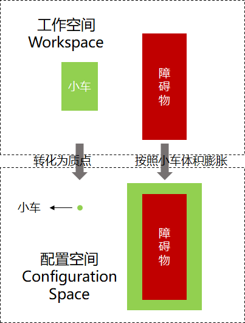

这样，在进行路径规划时，就可以将机器人当做一个点来处理了。

## 图搜索算法概述

下面切入正题，图搜索算法的基本流程如下：

- 创建一个容器，一般称为**openlist**，用来存储将要访问的节点
- 将起点加入容器
- loop：
  - 弹出：从容器中取出一个节点
  - 扩展：获取该节点周围的节点，将这些节点放入容器

下面将介绍几种图搜索算法，首先介绍两种针对无权图的基本图搜索算法：**深度优先搜索(Depth First Search, DFS)**、**广度优先搜索(Breadth First Search, BFS)**。它们的区别在于openlist所选用的数据结构类型不同，前者使用栈，后者使用队列；之后引入一种启发式搜索算法：**贪婪最佳优先算法**(**Greedy Best First Search, GBFS**)，提高搜索效率；最后介绍两种在路径规划中非常经典的算法：**Dijkstra算法**、**A*算法**，前者是广度优先算法(BFS)在带权图中的扩展，后者则是在前者中加入启发函数得到的算法。

## 深度优先搜索(DFS)

深度优先，顾名思义即深度越大的节点会被优先扩展。在DFS中，使用**栈(Stack)**数据结构来实现上述特性。

栈是一种**后进先出(LIFO)**的容器，如下图

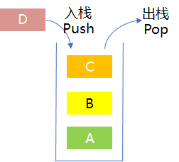

以在下面的**无权图**中找到从节点`a`到节点`i`的路径为例，说明一下DFS算法的工作流程

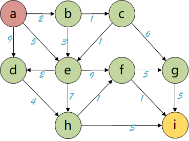

按照上节的图搜索算法的基本流程进行搜索，过程如下：

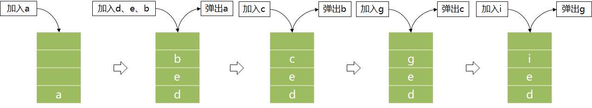

从`i`回溯得到路径：`a`->`b`->`c`->`g`->`i`，如下：

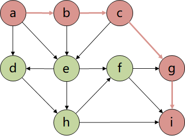

DFS能够快速地找到一条路径，是一种以时间换空间的方法。将其应用到二维地图的路径规划中，如下图，很显然找到的路径**并不是移动机器人运动规划所需要的最优路径**

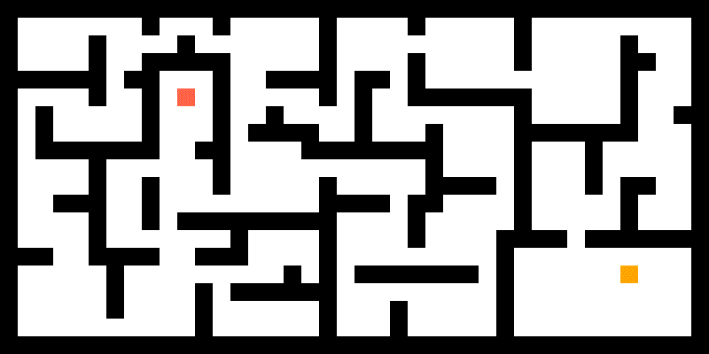

## 广度优先搜索(BFS)

与DFS的“不撞南墙不回头”的个性不同，BFS在搜索时呈**波状推进**形式，一路稳扎稳打，它是一种**以时间换空间**的方法，能够保证搜索到的路径是最优的。

为了实现波状推进搜索特性，BFS采用**队列(Queue)**作为openlist的数据结构。队列是一种**先进先出(FIFO)**的容器，如下图

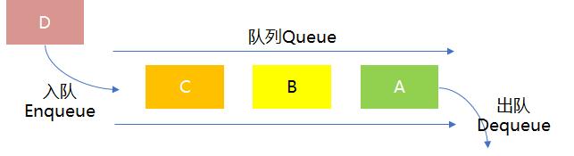

其流程与上节中DFS类似，继续以上节的图举例，过程如下，首先创建一个队列作为容器，将节点`a`加入队列

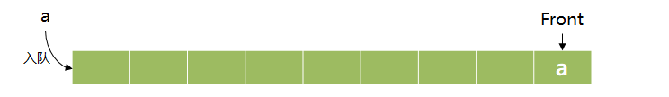

接着将节点`a`弹出队列，将节点`a`周围没有访问过的节点加入队列

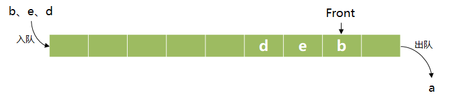

按照上面的流程不断地**弹出、扩展**节点，直到找到节点`i`为止，完整流程如下图：

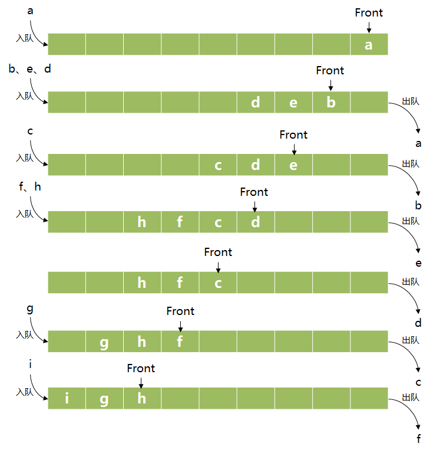

从终点回溯，`i`的父节点为`f`，`f`的父节点为`e`，`e`的父节点为`a`，这样就可以得到`a`到`i`的最短路径为：`a`->`e`->`f`->`i`，如下

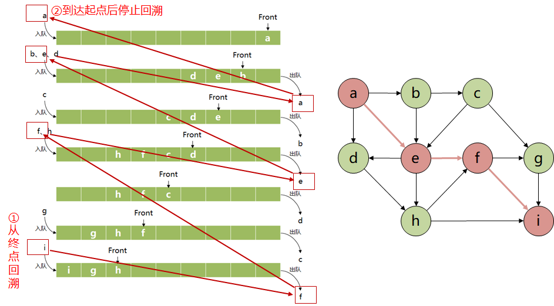

显而易见，相较于DFS，BFS中使用了大量的入队、出队操作，耗时增加，但是能保证找到最优路径。

## 启发式搜索算法

BFS和DFS的区别主要在于节点的弹出策略，根据弹出策略的区别，分别使用了队列和栈两种数据结构，而栈和队列作为两种相当基本的容器，只将节点进入容器的顺序作为弹出节点的依据，并未考虑目标位置等因素，这就使搜索过程变得漫无目的，导致效率低下。**启发式搜索算法(Heuristic Algorithm)**就是用来解决搜索效率问题的，下面将以**贪婪最佳优先算法**(**Greedy Best First Search, GBFS**)为例来介绍启发式搜索算法。

GBFS也是图搜索算法的一种，它的算法流程和BFS、DFS并没有本质的不同，区别仍然在于openlist采用的数据结构，GBFS使用的是**优先队列(Priority Queue)**，普通队列是一种先进先出的数据结构，而在优先队列中元素被赋予了**优先级**，最高优先级元素优先删除，也就是first in, largest out。(记住这种数据结构，后面的Dijkstra和A*算法都会用到这个结构)。

**在图搜索算法中，使用代价函数$f(n)$来作为优先级判断的标准，$f(n)$越小，优先级越高，反之优先级越低。**

GBFS作为一种启发式搜索算法，使用**启发评估函数**$h(n)$来作为代价函数，也就是
$$
f(n)=h(n)
$$
其中$h(n)$是当前节点到终点的代价，它可以指引搜索算法往终点靠近，主要用**欧氏距离(Euclidean Distance)**或者**曼哈顿距离(Manhattan Distance)**来表示，它们的区别如下图：

假设有两个点$(x_1, y_1)$和$(x_2,y_2)$，则它们的欧氏距离和曼哈顿距离分别为：
$$
D_{Euclidean}=\sqrt{(x_1-x_2)^2 + (y_1 - y_2)^2}\\
D_{Manhattan}=|x_1-x_2| + |y_1-y_2|
$$

将GBFS应用在二维地图路径规划中，如下图，可以看到它的指向性或者说目的非常明显，从起点直扑终点。

但是在实际的地图中，常常会有很多障碍物，它就很容易陷入局部最优的陷阱。下图的地图中有一个专门设置的局部最优陷阱，很显然GBFS虽然搜索速度够快，但是找不到最优路径。

将其应用到复杂二维地图路径规划中，效果如下：

## Dijkstra算法

上面的算法中，只有广度优先搜索(BFS)具有完备性，能够保证搜索到最优路径。但是可以看到BFS算法搜索到的路径只用向上/下/左/右移动这四个动作，它们是没有权值或者说权值都相同的，只能用于无权图的路径规划，无法实现能够对角移动的路径规划。因此下面介绍一种能用于带权图的图搜索算法——Dijkstra算法(狄克斯特拉算法)。

Dijkstra算法是从一个顶点到其余各顶点的最短路径算法，其流程仍然与上述算法基本一致，它也是用优先队列作为openlist的数据结构，它和GBFS的区别在于代价函数$f(n)$的定义，Dijkstra算的$f(n)$定义为：
$$
f(n)=g(n)
$$
其中$g(n)$表示**从起点到当前点的移动代价**。

以下图为例，计算左上角起点到右下角终点的最短路径，箭头上的数值表示**两个节点间的距离**

首先扩展第一个节点，计算其余节点与第一个节点的距离，用橙色标出已经扩展的节点，未扩展的节点仍用绿色标出，其中圆中的数值表示**该节点的代价函数**，字母则表示该节点没有直接到达此时已扩展节点的路径。从未扩展的节点(绿色节点)中选择代价函数最小的节点进行拓展，并更新其余节点的代价函数，如下图

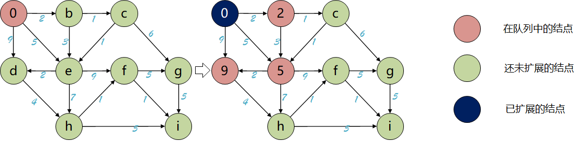

重复进行上面的步骤，直到所有节点都已扩展。

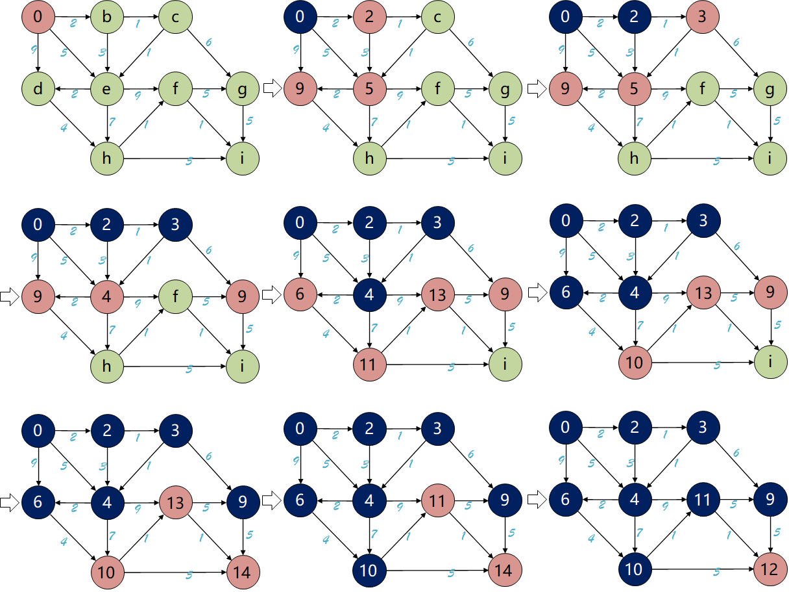

最后标出左上角节点到右下角节点的最短路径

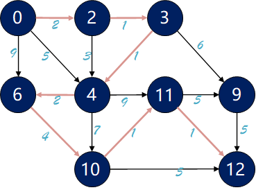

将Dijkstra算法应用到二维地图路径规划中，如下图，可以看到Dijkstra算法能够得到最优路径，但是它的速度和BFS是一样的，采取的都是稳扎稳打、波状前进的方式，导致速度较慢。

## A*算法

对比GBFS和Dijkstra算法，两者都采用优先队列作为openlist，而代价函数的不同导致两者具有不同的优点：GBFS用节点到目标点的距离作为代价函数，将搜索方向引向目标点，搜索效率高；而Dijkstra算法采用起点到当前扩展节点的移动代价作为代价函数，能够确保路径最优。

那么可不可以将两者的代价函数进行融合，从而**在保证路径最优的同时提高搜索效率**？答案是肯定的，融合后的算法就是**A*算法**。

|  |  |  |
| :----------------------------------------------------------: | :----------------------------------------------------------: | :----------------------------------------------------------: |
|                           GBFS算法                           |                         Dijkstra算法                         |                          Astar算法                           |

A*算法也是一种启发式算法，它的代价函数表示为：
$$
f(n)=g(n)+h(n)
$$
其中$g(n)$为起点到当前扩展节点的移动代价函数，$h(n)$是启发函数，用节点到目标点的距离函数来表示。

根据这个式子，可以得到A*算法的几个特点：

- 如果令$h(n)=0$，A* 算法就退化为Dijkstra算法；如果令$g(n)=0$，A* 算法就退化为GBFS算法。
- 能否找到最优路径的关键是启发函数$h(n)$的选取，如果$h(n)$在大部分情况下比从当前节点到目标点的移动代价小，则能找到最优路径。
- 由于A* 算法的启发函数是位置上的距离，因此在不带位置信息的图数据中不适用。

将A*算法应用到二维地图路径规划中，如下图：

## 附录：图基础

本节附录将介绍**什么是图数据结构**，以及**图数据结构在计算机中的表示方法**。

### 图结构

图结构是一种由**数据元素集合**及**元素间的关系集合**组成的**非线性数据结构**。数据元素用**节点(node)**表示，元素间的关系用**边(edge)**表示，如果两个元素相关，就用一条边将相应的节点连接起来，这两个节点称为相邻节点。根据边的方向性，可以分为无向图和有向图，一个无向图G记做$G=(V,E)$，其中$V$是节点的有限集合，$E$是边的有限集合，则有：
$$
\begin{equation}
V=\{x|x\in某个具有相同特性的数据元素集合 \}\\
E=\{e(x,y)|x,y\in V\}
\end{equation}
$$
上式中，$e(x,y)$表示节点x和节点y之间的相邻关系，是一种无序节点对，**无方向性**，称为连接节点x和节点y的一条边。如果节点间关系是有序节点对，则用$e<x,y>$表示，表示从节点x到节点y的一条单向边，是**有方向的**，则有向边的集合可表示为：
$$
E=\{e<x,y>|x,y\in V\}
$$
下图分别为无向图和有向图的图形化示例：

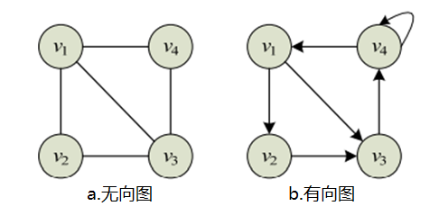

上图中的无向图可以表示为：
$$
\begin{equation}
V(G)=\{v_1,v_2,v_3,v_4\}\\
E(G)=\{(v_1,v_2),(v_1,v_3),(v_1,v_4),(v_2,v_3),(v_3,v_4)\}
\end{equation}
$$
无向图可表示为：
$$
\begin{equation}
V(G)=\{v_1,v_2,v_3,v_4\}\\
E(G)=\{<v_1,v_2>,<v_1,v_3>,<v_2,v_3>,<v_3,v_4>,<v_4,v_4>,<v_4,v_1>\}
\end{equation}
$$
在图中除了用边表示两个节点之间的相邻关系外，有时还需要表示它们相关的强度信息，例如从一个节点到另一个节点的距离、花费的代价、所需的时间等，诸如此类的信息可以通过在图的每条边上加上一个称作**权**(weight)的数值表示，这类图称为**带权图**

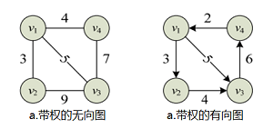

上述就是图结构的基本概念，我们还需要知道**图结构在计算机中的表示方法**

### 图结构的邻接矩阵表示法

**邻接矩阵**用来表示图的边集，即节点间的相邻关系集合。设$G=(V,E)$是一个具有n个节点的图，它的邻接矩阵是一个n阶矩阵，则其中的元素$a_{ij}$满足：
$$
a_{ij}=\begin{cases}1&若e(v_i,v_j)\in E或者e<v_i,v_j>\in E\\
0&若e(v_i,v_j)\notin E或者e<v_i,v_j>\notin E\end{cases}
$$
对于无向图，其邻接矩阵是对称矩阵，即$a_{ij}=a_{ji}$，而有向图的邻接矩阵不一定对称，其空间复杂度均为$O(n^2)$。以下为两个不带权图的邻接矩阵示例：

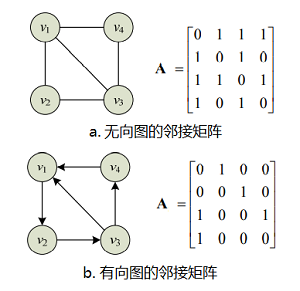

对于**带权图**，设$e(v_i,v_j)$或者$e<v_i,v_j>$上的权值为$w_{ij}$，则带权图的邻接矩阵定义为：
$$
a_{ij}=\begin{cases}w_{ij}&若e(v_i,v_j)\in E或者e<v_i,v_j>\in E\\
\infty&若e(v_i,v_j)\notin E或者e<v_i,v_j>\notin E\\
0&若v_i=v_j
\end{cases}
$$
以下为两个带权图的邻接矩阵示例：

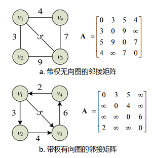

### 图结构的邻接表表示法

邻接矩阵表示法的空间复杂度为$O(n^2)$，其占用的空间大小与图中**节点数量**相关，而与边的数目无关。对于稀疏图，其边的数量可能远小于$n^2$，这样邻接矩阵中就会有很多零或$\infty$元素。对于这种情况，可以**用节点表和邻接表来表示和存储图结构**，其占用的存储空间既与图的节点数有关，也与边数有关。

图的节点表用来保存图中的所有节点，通常是一个顺序存储的线性表，该线性表中的每个元素对应图中的一个节点，该节点类型包括两个基本成员：节点数据元素信息data和指向该节点的邻接表neighbors。对于无向图有：

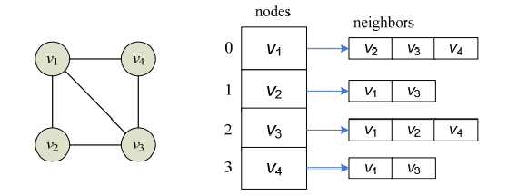

## 参考

[图的实现(c++)](https://blog.csdn.net/y1054765649/article/details/88763699)

[机器人路径规划之Dijkstra算法](https://blog.csdn.net/qq_42688495/article/details/106269382)