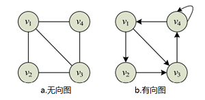
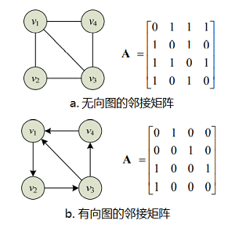

# 基于图搜索的路径规划算法

## 配置空间(Configuration Space)

我们首先了解一下配置空间这个概念，在工作空间(Workspace)中，机器人是有形状和大小的，这不利于进行运动规划。要将工作空间转换到配置空间中，即将机器人当做一个**质点**，而将障碍物按照机器人的体积进行膨胀，如下图：

## 图基础

### 图结构

图结构是一种由**数据元素集合**及**元素间的关系集合**组成的非线性数据结构。数据元素用**结点**(node)表示，如果两个元素相关，就用一条**边**(edge)将相应的结点连接起来，这两个结点称为相邻结点。根据边的方向性，可以分为无向图和有向图，一个无向图G记做$G=(V,E)$，其中$V$是结点的有限集合，$E$是边的有限集合，则有：
$$
\begin{equation}
V=\{x|x\in某个具有相同特性的数据元素集合 \}\\
E=\{e(x,y)|x,y\in V\}
\end{equation}
$$
上式中，$e(x,y)$表示结点x和结点y之间的相邻关系，是一种无序结点对，**无方向性**，称为连接结点x和结点y的一条边。如果结点间关系是有序结点对，则用$e<x,y>$表示，表示从结点x到结点y的一条单向边，是**有方向的**，则有向边的集合可表示为：
$$
E=\{e<x,y>|x,y\in V\}
$$
下图分别为无向图和有向图的图形化示例：

上图中的无向图可以表示为：
$$
\begin{equation}
V(G)=\{v_1,v_2,v_3,v_4\}\\
E(G)=\{(v_1,v_2),(v_1,v_3),(v_1,v_4),(v_2,v_3),(v_3,v_4)\}
\end{equation}
$$
无向图可表示为：
$$
\begin{equation}
V(G)=\{v_1,v_2,v_3,v_4\}\\
E(G)=\{<v_1,v_2>,<v_1,v_3>,<v_2,v_3>,<v_3,v_4>,<v_4,v_4>,<v_4,v_1>\}
\end{equation}
$$
在图中除了用边表示两个结点之间的相邻关系外，有时还需要表示它们相关的强度信息，例如从一个结点到另一个结点的距离、花费的代价、所需的时间等，诸如此类的信息可以通过在图的每条边上加上一个称作**权**(weight)的数值表示，这类图称为**带权图**

为了方便之后写代码验证，还需要知道图结构在计算机中的表示方法

### 图结构的邻接矩阵表示法

邻接矩阵用来表示图的边集，即结点间的相邻关系集合。设$G=(V,E)$是一个具有n个节点的图，它的邻接矩阵是一个n阶矩阵，则其中的元素$a_{ij}$满足：
$$
a_{ij}=\begin{cases}1&若e(v_i,v_j)\in E或者e<v_i,v_j>\in E\\
0&若e(v_i,v_j)\notin E或者e<v_i,v_j>\notin E\end{cases}
$$
对于无向图，其邻接矩阵是对称矩阵，即$a_{ij}=a_{ji}$，而有向图的邻接矩阵不一定对称，其空间复杂度均为$O(n^2)$。以下为两个不带权图的邻接矩阵示例：

对于**带权图**，设$e(v_i,v_j)$或者$e<v_i,v_j>$上的权值为$w_{ij}$，则带权图的邻接矩阵定义为：
$$
a_{ij}=\begin{cases}w_{ij}&若e(v_i,v_j)\in E或者e<v_i,v_j>\in E\\
\infty&若e(v_i,v_j)\notin E或者e<v_i,v_j>\notin E\\
0&若v_i=v_j
\end{cases}
$$
以下为两个带权图的邻接矩阵示例：

### 图结构的邻接表表示法

邻接矩阵表示法的空间复杂度为$O(n^2)$，其占用的空间大小与图中结点数量相关，而与边的数目无关，对于稀疏图，其边数可能远小于$n^2$，这样邻接矩阵中就会有很多零或$\infty$元素。对于这种情况，可以**用结点表和邻接表来表示和存储图结构**，其占用的存储空间既与图的结点数有关，也与边数有关。

图的结点表用来保存图中的所有结点，通常是一个顺序存储的线性表，该线性表中的每个元素对应图中的一个结点，该结点类型包括两个基本成员：结点数据元素信息data和指向该结点的邻接表neighbors。对于无向图有：

## 图搜索算法概述

基本流程如下：

- 创建一个容器，用来存储将要访问的结点

- 开始循环：
  - 弹出：从容器中取出一个结点
  - 扩展：获取该结点周围的结点，将这些结点放入容器

下面介绍两种基本的图搜索算法：**广度优先搜索(Breadth First Search, BFS)**，**深度优先搜索(Depth First Search, DFS)**。

### BFS

BFS是一种基于队列的搜索算法，队列是一种**先进先出(FIFO)**的容器，如下图

以下面的图为例，找到从结点`a`到结点`b`的路径，说明一下BFS算法的工作流程

按照上节的图搜索算法的基本流程，首先创建一个队列作为容器，将结点`a`加入队列

接着将结点`a`弹出队列，将结点`a`周围的结点加入队列

完整流程如下图：

### DFS

与BFS不同，DFS是一种基于栈的搜索算法，栈是一种**后进先出(LIFO)**的容器，如下图

### 启发式搜索算法

## Dijkstra算法

Dijkstra算法(狄克斯特拉算法)是从一个顶点到其余各顶点的最短路径算法，其基本原理是：每次新扩展一个距离最短的点，更新与其相邻的点的距离。

以下图为例，计算左上角节点到右下角节点的最短路径，箭头上的数值表示**两个节点间的距离**

首先扩展第一个节点，计算其余节点与第一个节点的距离，如下图所示，用橙色标出已经扩展的节点，未扩展的节点仍用绿色标出，其中圆中的数值表示**与第一个节点之间的距离**，$\infty$表示该节点没有直接到达此时已扩展节点的路径。

从未扩展的节点（绿色部分）中选择距离最小的节点进行拓展，并更新其余节点到第一个节点的距离，如下图

重复进行上面的步骤，直到所有节点都已扩展。

最后标出左上角节点到右下角节点的最短路径

## A*算法

A*算法是一种启发式算法，该算法是在Dijkstra算法的基础上加入了一个代价函数

## JPS算法

## 参考

[图的实现(c++)](https://blog.csdn.net/y1054765649/article/details/88763699)