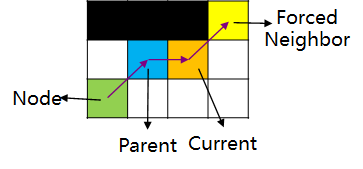

# JPS算法

JPS算法全称为Jump Point Search，也就是跳点算法，可以视为A\*算法的一种改进算法，它保留了A\*算法的主体框架，区别在于：A\*算法是将当前节点的所有未访问邻居节点加入openlist，而JPS则是使用一些方法将有“价值”的节点加入openlist，具体方法就是本文的内容。以下面两图为例，简单说说JPS的改进效果。

两图中深蓝色的点表示在openlist中的节点，淡蓝色表示已经探索过的节点。可以观察到JPS算法的openlist最多只有4个节点，而A\*算法的openlist中则有非常多的节点。由于JPS和A\*都使用优先队列作为openlist容器，而**JPS中的openlist所涉及到的排序、弹出等操作更少**，所以JPS能达到比A\*更高效的搜索效率。

|  |  |
| :--------------------------------------------: | :----------------------------------------: |
|                       A*                       |                    JPS                     |

当然上面只是从结果上对改进的原因进行分析，也可以从原理上进行分析。首先了解一下路径的对称性，下面两张图分别是Dijkstra算法和A\*算法的搜索结果，可以看到两者搜索到的路径并不相同，但是路径长度是一样的，这就是路径的对称性，Dijkstra和A\*都会探索很多条对称的路径，而JPS就是专门用来打破对称性的。

|  |  |
| :------------------------------------------------------: | :------------------------------------------------: |
|                         Dijkstra                         |                         A*                         |

## 基本定义

JPS算法，顾名思义，它的算法核心就是寻找**跳点(Jump Point)**，在JPS中，就是将跳点加入openlist。那么什么是跳点呢？在介绍前我们先了解一下**强迫邻居(forced neighbors)**。以下图为例，黑色色块表示障碍物，橙色色块表示当前节点(current)，绿色色块表示上一点(Parent)，而黄色色块就是current节点的Forced Neighbor。从parent节点水平**跳跃**到current节点，这时current节点上方被障碍物挡住了，使路径`parent`→`current`→`Forced Neighbor`成为了parent节点和Forced Neighbor节点间的最短路径，current节点也就成为了从parent节点到Forced Neighbor节点的**跳点**。

如果将current节点上方的障碍物去掉，那么还存在其他的最短路径，如下图，这时黄色色块就不能称作current节点的Forced Neighbor了。

上文中提到从parent节点到Current节点的过程称为**跳跃(Jump)**，分为直线跳跃(Jumping Straight)和对角线跳跃(Jumping Diagonally)，直线跳跃又分为水平跳跃和垂直跳跃，如下图，橙色箭头表示直线跳跃，紫色箭头表示对角线跳跃。一般情况都是先直线跳跃，再进行对角线跳跃。在进行直线跳跃时，如果跳跃到障碍物或者边界，则返回parent进行对角线跳跃；当对角线跳跃后的节点是障碍物或者边界时，则停止跳跃。

所以定义：**具有强迫邻居的节点就是跳点**。当然这个定义并不严格，如下图，绿色的node就是从openlist中弹出的节点，从Start进行对角线跳跃到蓝色的parent节点，再由parent直线跳跃至current，发现current具有一个Forced Neighbor，所以current是一个跳点，但是从node到current不能直接进行跳跃，而是要经过parent，所以parent也是一个跳点。所以继续定义：**如果节点x由前一个节点经过对角线跳跃得到，同时从x进行直线跳跃得到的current节点是一个跳点，那么节点x也是跳点。**

## 算法流程

JPS的基本流程与A\*一致，代价函数$f(n)$仍然表示如下：
$$
f(n)=g(n)+h(n)
$$
区别于A\*中的节点类，JPS中还需要添加一个`forced_neighbor_list`，用它来保存强迫节点相对于该节点的位置，指示该节点的跳跃方向。举个栗子，如果强迫节点在该节点的右上方，同时使用$(1,1)$表示右上方，那么可以将$(1, 1)$加入该节点的`forced_neighbor_list`，当从openlist弹出该节点时，就可以继续往强迫节点的方向$(1,1)$进行跳跃(包括直线和对角线跳跃)。

- 初始化起点节点`start`，将起点周围四个角落的空闲节点相对于起点的相对位置加入起点节点的`forced_neighbor_list`
- 创建一个`openlist`，将`start`加入`openlist`
- while openlist is not empty:
  - node ← openlist.Pop()
  - 从node开始跳跃，首先进行直线跳跃，再进行对角线跳跃。用parent表示从node进行对角线跳跃得到的节点，用current表示从parent进行直线跳跃得到的节点。
    - 如果current是跳点，而parent与node是同一个节点，则将current加入openlist，同时将current的父节点指向node；
    - 如果current是跳点，而parent与node不是同一个节点，则将parent和current加入openlist，同时将current的父节点指向parent，将parent的父节点指向node；
    - 如果current是障碍物或者边界，则进行对角线跳跃；
    - 如果parent是障碍物或者边界，则进入下一轮循环。

C#实现见：https://gitee.com/ghowoght/motion-planner/blob/develop/MotionPlanner/SearchBased/JPS.cs

## 仿真分析

主要和A\*算法进行对比，对于下面的大小为$200×400$的地图，分别使用A\*和JPS进行搜索从左上角红色起点到右下角橙色终点的路径。

搜索结果：

|  |  |
| :----------------------------------: | :------------------------------: |
|     A\*，$t_{consume}=4265.6ms$      |    JPS，$t_{consume}=117.1ms$    |

可见，由于JPS少了很多对openlist的操作，搜索效率比A*算法提高了一个等级。

## 参考

Harabor D D ,  Grastien A . Online Graph Pruning for Pathfinding on Grid Maps[C]// Aaai Conference on Artificial Intelligence. DBLP, 2011.

https://blog.csdn.net/u011265162/article/details/91048927