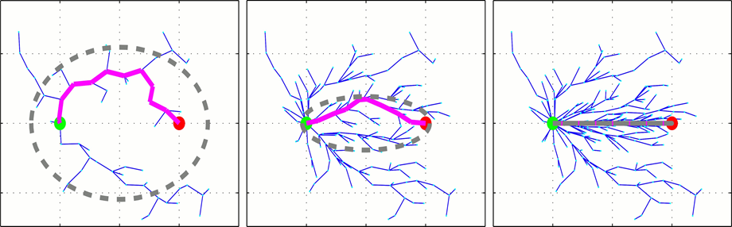
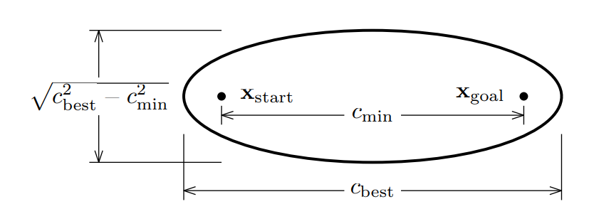
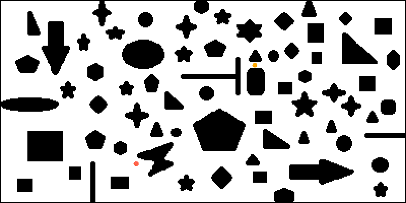

在文章[路径规划 | 随机采样算法：PRM、RRT、RRT-Connect、RRT*](https://zhuanlan.zhihu.com/p/349074802)中，介绍了具备渐近最优性的RRT\*算法。随着采样点数的增多，RRT\*算法的规划结果会逐渐收敛到最优。

但是可以观察到，RRT\*算法是对自由空间进行均匀采样，搜索树上会生成很多冗余的分支，我们可以对RRT\*算法的采样过程进行改进。

Informed-RRT*算法就是对RRT\*的采样过程进行优化得到的算法，它**采用一个椭圆采样方式来代替全局均匀采样**，如图：

接下来介绍**椭圆采样区域的表示方式**

标准椭圆方程为：
$$
\frac{x^2}{a^2} + \frac{y^2}{b^2} = 1
$$
焦点坐标为$(±c, 0)$，长轴长度为$a$，短轴长度为$b$，它们间满足：椭圆上任一点到两焦点的距离之和等于$2a$，可以得到：
$$
a^2=b^2+c^2
$$

Informed-RRT\*算法椭圆采样区域可由下图来表述。在Informed-RRT\*算法中，以起点$x_{start}$和终点$x_{goal}$作为椭圆的焦点，令$a$等于**初始路径长度的一半**，即$a=\frac{c_{best}}{2}$，则$c=\frac{c_{min}}{2}$，$b=\frac{\sqrt{c_{best}^2-c_{min}^2}}{2}$。这样就可以得到椭圆方程的所有参数。

在之后的迭代中，没找到一次更短的路径，就用这条更短路径的长度作为新的$c_{best}$，更新采样椭圆。

然后**在椭圆采样区域中进行采样**。

先在标准方程中采样，再将采样点旋转平移到实际采样区域，需要两个矩阵：平移向量、旋转矩阵。这两个参数只需要在初始化时计算即可

转换后的坐标为：
$$
\left[\begin{matrix}x'\\y'\end{matrix}\right]=\left[\begin{matrix}cos\theta&sin\theta\\-sin\theta &cos\theta\end{matrix}\right]\cdot\left[\begin{matrix}x\\y\end{matrix}\right]+\left[\begin{matrix}x_{center}\\y_{center}\end{matrix}\right]
$$
其中$R=\left[\begin{matrix}cos\theta&sin\theta\\-sin\theta &cos\theta\end{matrix}\right]$是旋转矩阵，$\theta$表示起点$x_{start}$和终点$x_{goal}$连线与$x$轴的夹角，$T=\left[\begin{matrix}x_{center}\\y_{center}\end{matrix}\right]$是平移向量，可以用起点$x_{start}$和终点$x_{goal}$的中点来表示。

除了采样过程外，Informed-RRT\*的流程和RRT\*是一样的。

## 参考

Gammell J D , Srinivasa S S , Barfoot T D . Informed RRT\*: Optimal Sampling-based Path Planning Focused via Direct Sampling of an Admissible Ellipsoidal Heuristic[J]. 2014.

