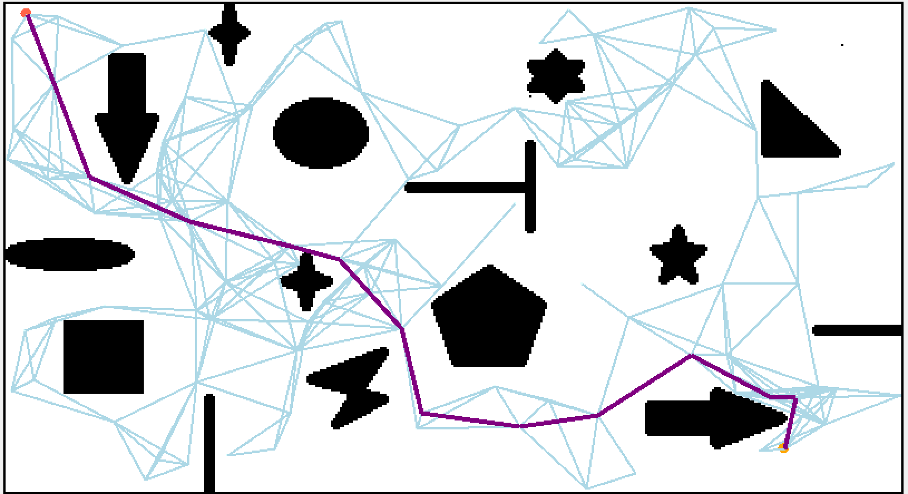

# 基于采样的路径规划算法

基于图搜索的路径规划算法主要用于低维度空间上的路径规划问题，它在这类问题中往往具有较好的完备性，但是需要对环境进行完整的建模工作，在高维度空间中往往会出现维数灾难。所以本文将介绍基于采样的路径规划算法，这类算法适用于高维度空间，但是它们是以牺牲完备性的方式来提高执行效率的。

### 概率路图算法(Probabilistic Road Map, PRM)

算法流程如下：

- 采样：在地图中随机撒点
- 生成概率路图：根据**点与点间的距离**和**点之间是否存在通路**将上步中得到的采样点进行连接
- 搜索路径：使用图搜索算法(如Dijkstra算法)在这个概率路图中搜索出一条从起点到终点的最短路径

## 快速随机扩展树算法(Rapidly-exploring Random Tree, RRT)

初始化节点

## 参考

[概率路线图(PRM)方法](https://zhuanlan.zhihu.com/p/65673502)

[运动规划RRT*算法图解](https://blog.csdn.net/weixin_43795921/article/details/88557317)