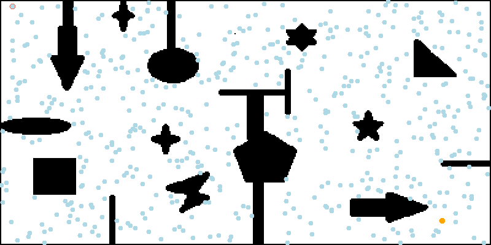
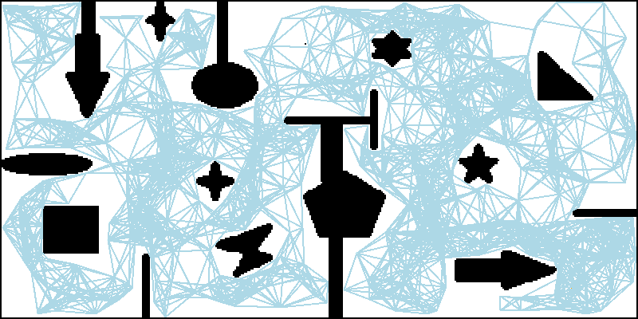
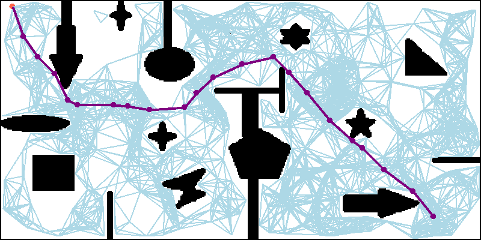
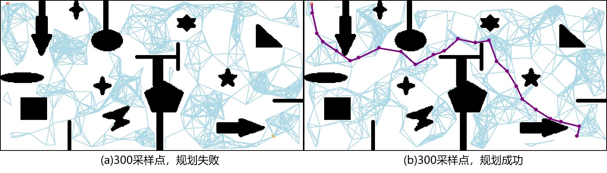
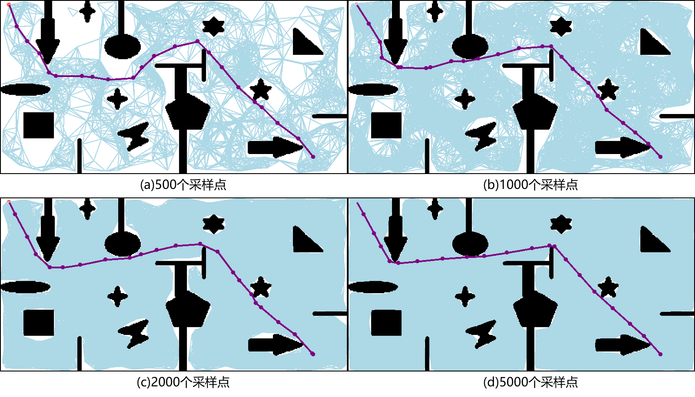
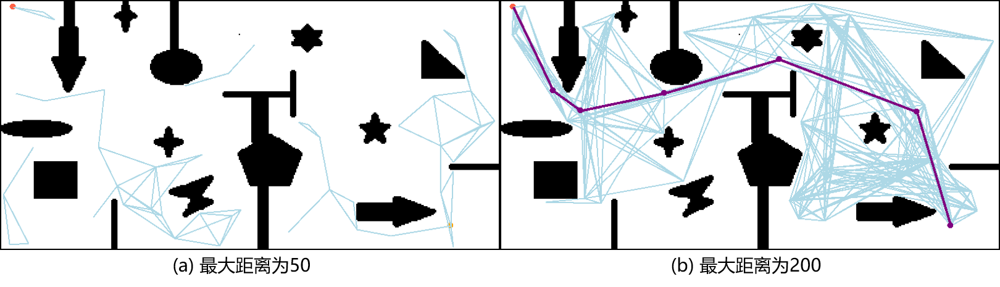
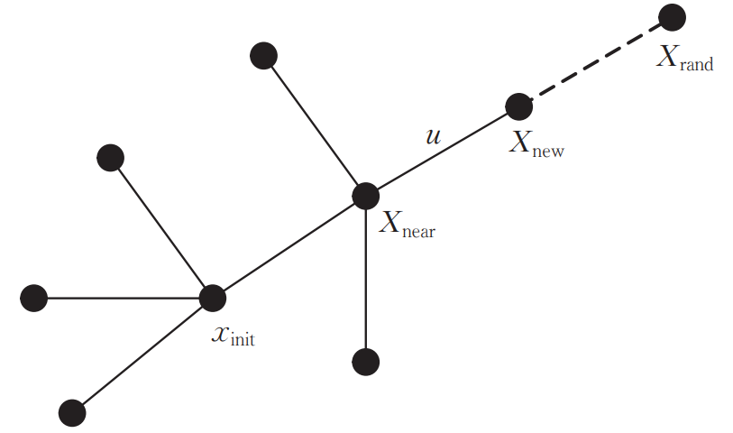
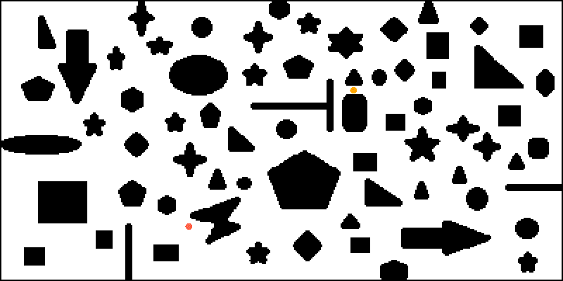
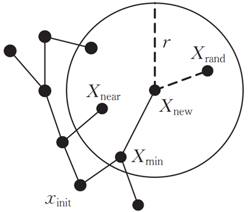

# 基于随机采样的路径规划算法——PRM、RRT、RRT-Connect、RRT\*

基于图搜索的路径规划算法主要用于低维度空间上的路径规划问题，它在这类问题中往往具有较好的完备性，但是需要对环境进行完整的建模工作，在高维度空间中往往会出现维数灾难。为了解决这些问题，本文将介绍基于**随机采样**的路径规划算法。这类算法适用于高维度空间，它们以**概率完备性(当时间接近无限时一定有解)**来代替**完备性**，从而提高搜索效率。

基于随机采样的路径规划算法又分为**单查询算法**(single-query path planning)以及**渐近最优算法**(asymptotically optimal path planning)，前者只要找到可行路径即可，侧重**快速性**，后者还会对找到的路径进行逐步优化，慢慢达到最优，侧重**最优性**。本文介绍的单查询方法为**概率路图算法(Probabilistic Road Map, PRM)**、**快速随机扩展树算法(Rapidly-exploring Random Tree, RRT)**、**RRT-Connect算法**，渐近最优算法有**RRT\*算法**。

## 概率路图算法(Probabilistic Road Map, PRM)

PRM算法首先使用随机采样的方式在环境中建立路径网络图，将连续的空间转换为离散的空间，然后在路径网络图上进行路径规划，解决在高维空间中搜索效率低的问题。

算法流程如下：

- **采样**：在地图中随机撒点，剔除落在障碍物上的点

  

- **生成概率路图**：根据**点与点间的距离**和**是否存在直线通路**将上步中得到的采样点进行连接

  

  

- **搜索路径**：使用图搜索算法(如Dijkstra算法)在上步得到的路图中搜索出一条从起点到终点的最短路径

  

其中**采样点的数量**和**采样点间存在通路的最大距离**是路径规划成功与否的关键。

采样点太少，可能会导致路径规划失败，下图(a)中不能生成完整的路图，导致规划失败；而同样是300个采样点，图(b)则能生成一个完整的路图

采样点数量增加，搜索到的路径会**逐渐接近最短路径**，但同时搜索效率会降低，如下图：

采样点间存在通路的最大距离对规划结果的影响和以上类似：距离太小，会导致规划失败；距离太大，会降低搜索效率。如下图(a)，由于设置的最大距离太小，不能生成一张完整的路图，导致规划失败；而图(b)虽然能找到路径，但是生成的路图中存在很多冗余通路。

PRM算法参数少、结构简单，能够提高高维空间搜索效率，也能在生成概率路图时添加机器人的运动学约束，使最终生成的路径符合机器人的运动学模型。同时，随机采样得到的概率路图只需要建立一次就可以一直使用，重用性强。但由于采样过程是完全随机的，得到的节点大多数都偏离最终路径，会增加额外的计算量。

## 快速随机扩展树算法(Rapidly-exploring Random Tree, RRT)

RRT算法是一种单查询(single-query)算法，目标是**尽可能快的找到一条从起点到终点的可行路径**。它的搜索过程类似于一棵树不断生长、向四周扩散的过程，它以起点作为根节点构建一棵搜索树$T$。

它的算法流程用伪代码描述如下：

------

$T.init(x_{init})$

$for$ $i = 1, ..., n$ $do$

​	$x_{rand}←SampleFree_i$;

​	$x_{near}←Nearest(T, x_{rand})$;

​	$x_{new}←Steer(x_{near}, x_{rand})$;

​	$if$ $ObtacleFree(X_{near}, x_{new})$ $then$

​		$T.add\_vertex(x_{new})$

​		$T.add\_edge(x_{near}, x_{new})$

​		$V←V\cup\{x_{new}\}; E←E\cup\{x_{near}, x_{new}\}$;

$return$ $G=(V, E)$;

------

其中$x_{init}$表示起点，$T$表示随机树，在算法开始时，将起点$x_{init}$加入到随机树。接下来使用$SampleFree$函数在自由空间中随机采样，获得一个采样点$x_{rand}$，再使用$Nearest$函数获得随机树中距离$x_{rand}$最近的一个节点$x_{near}$；使用$Steer$函数在$x_{near}$和$x_{rand}$的连线上距离$x_{near}$步长$u$的位置生成一个节点$x_{new}$，使用$ObtacleFree$函数判断$x_{near}$和$x_{new}$间是否存在直线通路，若存在则将$x_{new}$加入到随机树$T$的节点集合中，同时将$x_{nearest}$作为$x_{new}$的父节点，将边$(x_{nearest}, x_{new})$加入到随机树$T$的边集中

扩展流程如图：

1. 在自由空间中随机采样得到采样点$X_{rand}$
2. 从搜索树$T$中找出距离采样点$X_{rand}$最近的节点$X_{near}$
3. 计算$X_{near}$和$X_{rand}$之间的距离。如果距离大于步长$u$，则从$X_{near}$向$X_{rand}$移动步长$u$后得到新节点$X_{new}$；否则在$X_{rand}$位置生成新节点$X_{new}$。
4. 如果$X_{new}$和$X_{near}$间存在直线通路，则将$X_{new}$加入搜索树$T$，它的父节点为$X_{near}$；否则进入下一轮循环

上述是基础的RRT算法流程，它的采样过程是完全随机的，还可以在采样时**以一定的概率直接采样终点作为**$x_{rand}$，加快搜索速度。

RRT作为一种随机采样的规划算法，它的复杂度也不受地图的离散程度影响，在高维空间中仍具有很高的搜索效率。但是前面提到RRT是一种单查询算法，只管尽快地找到可行路径，所以最终路径并不是最优的，甚至会非常“绕”。

## RRT-Connect

RRT-Connect在RRT的基础上引入了双树扩展环节，分别**以起点和目标点为根节点生成两棵树进行双向扩展**，

当两棵树建立连接时可认为路径规划成功。通过一次采样得到一个采样点$x_{rand}$，然后两棵搜索树同时向采样点$x_{rand}$方向进行扩展，加快两棵树建立连接的速度。相较于单树扩展的RRT算法，RRT-Connect加入了**启发式**步骤，加快了搜索速度，对于狭窄通道也具有较好的效果。

但是RRT-Connect和RRT一样，都是单查询算法，最终路径并不是最优的。接下来介绍**基于随机采样的渐近最优路径规划算法**。

## 最优快速随机扩展树(Optimal RRT, RRT*)

RRT\*算法是一种渐近最优算法。

算法流程与RRT算法流程基本相同，不同之处就在于最后加入将$X_{new}$加入搜索树$T$时**父节点的选择策略**。

RRT\*算法在选择父节点时会有一个**重连(Rewire)**过程，也就是在以$X_{new}$为圆心、半径为$r$的邻域内，找到与$X_{new}$连接后路径代价(从起点移动到$X_{new}$的路径长度)最小的节点$X_{min}$，并重新选择$X_{min}$作为$X_{new}$的父节点，而不是$X_{near}$。重连过程的示意图如下：

## 参考

Lavalle S M . Rapidly-Exploring Random Trees: A New Tool for Path Planning[J]. Research Report, 1999.

Jr J ,  Lavalle S M . RRT-Connect: An Efficient Approach to Single-Query Path Planning[C]// Proceedings of the 2000 IEEE International Conference on Robotics and Automation, ICRA 2000, April 24-28, 2000, San Francisco, CA, USA. IEEE, 2000.

Karaman S , Frazzoli E . Sampling-based Algorithms for Optimal Motion Planning[J]. The International Journal of Robotics Research, 2011, 30(7):846-894.