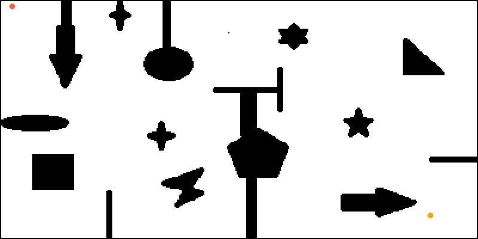
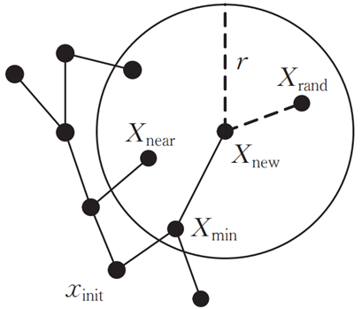
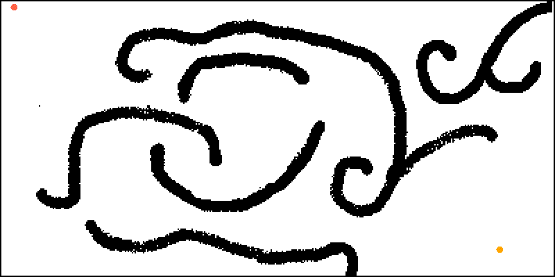

# 基于采样的路径规划算法

基于图搜索的路径规划算法主要用于低维度空间上的路径规划问题，它在这类问题中往往具有较好的完备性，但是需要对环境进行完整的建模工作，在高维度空间中往往会出现维数灾难。为了解决这些问题，本文将介绍基于**随机采样**的路径规划算法。这类算法适用于高维度空间，它们以**概率完备性(当时间接近无限时一定有解)**来代替**完备性**，从而提高搜索效率。

注：本文效果图均来自[我的开源仓库](https://gitee.com/ghowoght/motion-planner)

### 概率路图算法(Probabilistic Road Map, PRM)

PRM算法首先使用随机采样的方式在环境中建立路径网络图，将连续的空间转换为离散的空间，然后在路径网络图上进行路径规划，解决在高维空间中搜索效率低的问题。

算法流程如下：

- 采样：在地图中随机撒点，剔除落在障碍物上的点

  

- 生成概率路图：根据**点与点间的距离**和**是否存在直线通路**将上步中得到的采样点进行连接

  

  

- 搜索路径：使用图搜索算法(如Dijkstra算法)在上步得到的路图中搜索出一条从起点到终点的最短路径

  

其中**采样点的数量**和**采样点间存在通路的最大距离**是路径规划成功与否的关键。

采样点太少，可能会导致路径规划失败，下图(a)中不能生成完整的路图，导致规划失败；而通样是300个采样点，图(b)则能生成一个完整的路图

采样点数量增加，搜索到的路径会**逐渐接近最短路径**，但同时搜索效率会降低，如下图：

采样点间存在通路的最大距离对规划结果的影响和以上类似：距离太小，会导致规划失败；距离太大，会降低搜索效率。如下图(a)，由于设置的最大距离太小，不能生成一张完整的路图，导致规划失败；而图(b)虽然能找到路径，但是生成的路图中存在很多冗余通路。

PRM算法参数少、结构简单，能够提高高维空间搜索效率，也能在生成概率路图时添加机器人的运动学约束，使最终生成的路径符合机器人的运动学模型。同时，随机采样得到的概率路图只需要建立一次就可以一直使用，重用性强。但由于采样过程是完全随机的，得到的节点大多数都偏离最终路径，会增加多余的计算。

## 快速随机扩展树算法(Rapidly-exploring Random Tree, RRT)

RRT的搜索过程类似于一棵树不断生长、向四周扩散的过程，它以起点作为根节点构建一棵搜索树$T$。

算法流程如下：

1. 将起点初始化为搜索树$T$的根节点$X_{init}$
2. 开始循环，直到找到终点或者已经采样得到最大采样点数：
   1. 在空间中采样得到采样点$X_{rand}$：按照设定的**随机采样概率**进行随机采样，其余情况直接将目标点作为采样点
   2. 从搜索树$T$中取出距离采样点$X_{rand}$最近的节点$X_{near}$。进行判断：
      - 如果$X_{rand}$和$X_{near}$间存在直线通路，则根据以下条件初始化一个新节点$X_{new}$：如果$X_{rand}$和$X_{near}$间的距离大于**步长**$u$，则将$X_{new}$初始化为$X_{near}$朝$X_{rand}$方向扩展步长$u$得到的新节点；否则直接将$X_{near}$初始化为$X_{rand}$
      - 如果$X_{rand}$和$X_{near}$间没有直线通路，则直接进入下一轮循环
   3. 将$X_{new}$加入搜索树$T$，它的父节点为$X_{near}$

节点扩展过程如下图所示

RRT算法以一定的概率直接对目标点进行采样，使搜索树快速朝目标点方向扩展，提高搜索效率。还可以通过优化数据结构的方式提高搜索效率。RRT搜索树有很多存储方式，我们可以使用**KD-Tree**来减少最近节点$X_{near}$的搜索时间。

## RRT-Connect

RRT-Connect分别**以起点和目标点为根节点生成两棵树进行双向扩展**，当两棵树建立连接时可认为路径规划成功。通过一次采样得到一个采样点，然后两棵搜索树同时向采样点方向进行扩展，加快两棵树建立连接的速度。

算法的运行效果如下图：

## RRT*

可以看到，RRT算法虽然能快速地找到路径，但是得到的路径并不光滑，对机器人移动而言不是最优路径。所以本节将引入RRT的改进算法——**RRT***

RRT*与RRT算法流程基本相同，不同之处就在于最后加入将$X_{new}$加入搜索树$T$时**父节点的选择策略**。

RRT\*算法在选择父节点时会有一个**重连(Rewire)**过程，也就是在以$X_{new}$为圆心、半径为$r$的邻域内，找到与$X_{new}$连接后代价(从起点移动到$X_{new}$的路程)最小的节点$X_{min}$，并选择$X_{min}$作为$X_{new}$的父节点，而不是$X_{near}$。重连过程的示意图如下：

加入重连步骤后，可以确保在$X_{new}$的邻域范围得到的路径是最优的，所以相较于RRT算法得到的路径，RRT*算法得到的路径更为平直，如下图：

## RRT*-Connect

与RRT-Connect类似，最大的区别就是将搜索树的构建方式由RRT替换为RRT*

## 参考

[概率路线图(PRM)方法](https://zhuanlan.zhihu.com/p/65673502)

[运动规划RRT*算法图解](https://blog.csdn.net/weixin_43795921/article/details/88557317)

陈秋莲, 蒋环宇, 郑以君. 机器人路径规划的快速扩展随机树算法综述[J]. 计算机工程与应用, 2019(16):10-17.

Klemm S , Oberlnder J , Hermann A , et al. RRT*-Connect: Faster, Asymptotically Optimal Motion Planning[C]// 2015 IEEE International Conference on Robotics and Biomimetics (ROBIO 2015). IEEE, 2015.