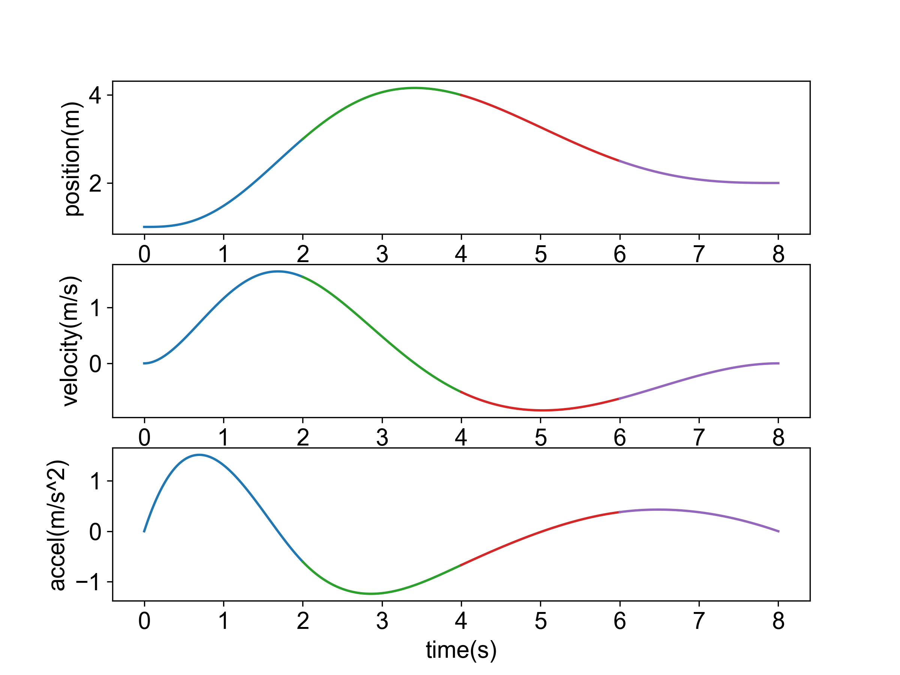
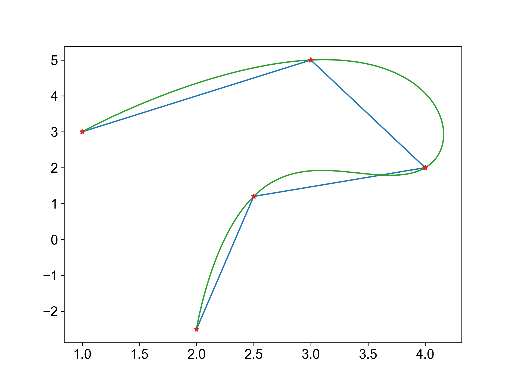

# 轨迹优化 | Minimum-jerk

使用路径规划可以得到一系列的路径点，如下图所示有5个路径点，这条路径是很曲折的，这不利于机器人的移动，试想一个机器人直接沿着这条路径进行移动，当到达一个路径点后速度减到零，原地旋转，指向下一个路径点，再继续移动，这不仅智障，而且浪费能量。于是我们就想，能不能规划出一条轨迹，使机器人能够在每一个路径点处能够平滑过渡，从而表现得机灵一点。这就是轨迹规划问题。

|  |  |
| :-------------------------------------------------------: | :----------------------------------------------------------: |
|                   路径规划得到的路径点                    |                   轨迹优化得到的轨迹(橙色)                   |


## 二次规划(Quadratic Programming, QP)

由于轨迹规划问题可以归结为一个二次规划问题，所以这里先对二次规划进行一个简单的介绍

### 二次型

含有$n$个变量$x=x_1,x_2,\cdots,x_{n-1},x_n$的二次齐次函数：
$$
\begin{aligned}
f(x_1,x_2,\cdots,x_n)&=a_{11}x_1^2+a_{22}x_2^2+\cdots+a_{nn}x_n^2\\
&+2a_{12}x_1x_2+2a_{13}x_1x_3+\cdots+2a_{n-1,n}x_{n-1}x_n
\end{aligned}
$$
称为二次型。取$a_{ij}=a_{ji}$，则有$2a_{ij}x_ix_j=a_{ij}x_ix_j+a_{ji}x_jx_i$，上式可表示为：
$$
f=\sum_{i,j=1}^na_{ij}x_ix_j
$$
矩阵表示为：
$$
f=x^TAx
$$

### 二次规划问题

当目标函数$f$为二次型，且约束为线性约束时，该优化问题就是二次规划问题，一般形式表述如下：
$$
\begin{aligned}
\mathop{min}\limits_{x} f(x)&=\frac{1}{2}x^TQx+q^Tx\\
s.t. Ax&=b\\
Gx&≤h
\end{aligned}
$$
二次规划是一类凸优化问题，目前有很多商业或者开源的求解器来求解这类问题，不再赘述

## 轨迹表示形式

使用路径规划可以得到一系列的路径点，这些路径点是不带时间信息的，而轨迹则是时间$t$的函数，一般用$n$**阶多项式**表示，即：
$$
\begin{aligned}
f(t)&=p_0+p_1t+p_2t^2+\cdots+p_nt^n\\
&=\sum_\limits{i=0}^np_it^i
\end{aligned}
$$

其中$p_0,p_1,\cdots,p_n$是轨迹参数，也是我们的优化参数。将$f(t)$写成向量相乘形式，得到：
$$
f(t)=\begin{bmatrix}1&t&\cdots&t^n\end{bmatrix}\begin{bmatrix}p_0\\p_1\\\vdots\\p_n\end{bmatrix}
$$
对轨迹函数求导，还能写出速度、加速度、jerk等参数随时间变化的函数：

$$
\begin{aligned}
vel(t)&=f^{(1)}(t)=\begin{bmatrix}0&1&2t&3t^2&\cdots&\frac{n!}{(n-1)!}t^{n-1}\end{bmatrix}\cdot p\\
acc(t)&=f^{(2)}(t)=\begin{bmatrix}0&0&2&6t&\cdots&\frac{n!}{(n-2)!}t^{n-2}\end{bmatrix}\cdot p\\
jerk(t)&=f^{(3)}(t)=\begin{bmatrix}0&0&0&6&\cdots&\frac{n!}{(n-3)!}t^{n-3}\end{bmatrix}\cdot p\\
\end{aligned}
$$
其中：$p=\begin{bmatrix}p_0&p_1&\cdots&p_n\end{bmatrix}^T$，概括得到轨迹导数的通式，$k$表示$k$阶导数：
$$
f^{(k)}(t)=\begin{bmatrix}
\overbrace {\begin{matrix}0&0&\cdots&0\end{matrix}}^\text{k}
&\overbrace {\begin{matrix}\frac{(k+0)!}{0!}t^{0}&\frac{(k+1)!}{1!}t^{1}&\frac{(k+2)!}{2!}t^{2}&\cdots &\frac{n!}{(n-k)!}t^{n-k}\end{matrix}}^\text{n-k+1}
\end{bmatrix}\cdot p
$$
一段复杂的轨迹常常需要用多个多项式来表示，可以将完整轨迹按照时间划分成多段，如下，将完整轨迹划分为$M$段多项式轨迹：
$$
f(t)=\begin{cases}
\begin{matrix}
p_{1,0}+p_{1,1}t+p_{1,2}t^2+\cdots+p_{1,n}t^n&T_0≤t≤T_1\\
p_{2,0}+p_{2,1}t+p_{2,2}t^2+\cdots+p_{2,n}t^n&T_1≤t≤T_2\\
\vdots\\
p_{M,0}+p_{M,1}t+p_{M,2}t^2+\cdots+p_{M,n}t^n&T_{M-1}≤t<T_M\\
\end{matrix}
\end{cases}
$$
其中：$p_{i,j}$表示第$i$段轨迹的第$j$个参数，**每段轨迹的时长都是预先分配好的，分配方法以后再叙述，本文暂时设置为固定值**。

## Minimum-jerk

以下将以Minimum-jerk算法为例来介绍轨迹优化算法的设计流程，Minimum-snap等算法的设计流程与之同理。

Minimum-jerk，顾名思义就是求解每段轨迹的系数$p$使得总的jerk最小，同时还要满足约束条件，所以这是一个**带约束的最优化问题**，通过后面的证明知道，它其实是一个二次规划问题。

### 多项式阶次选择

jerk是轨迹$f(t)$的3阶导数，所以令$K=3$。Minimum-jerk会直接对首尾的位置、速度和加速度进行约束，这就有6个等式约束了，所以优化参数必须提供6个以上的自由度，而5阶多项式有6个系数，所以符合要求的多项式的最小阶次为 $Order=5$。同理Minimum-snap还会对首尾的jerk进行约束，所以Minimum-snap的多项式最小阶数为 $7$ 。

因此可以选择五阶多项式来表示每一段轨迹，得到：
$$
f(t)=\begin{cases}
\begin{matrix}
p_{1,0}+p_{1,1}t+p_{1,2}t^2+p_{1,3}t^3+p_{1,4}t^4+p_{1,5}t^5&T_0≤t≤T_1\\
p_{2,0}+p_{2,1}t+p_{2,2}t^2+p_{2,3}t^3+p_{2,4}t^4+p_{2,5}t^5&T_1≤t≤T_2\\
\vdots\\
p_{M,0}+p_{M,1}t+p_{M,2}t^2+p_{M,3}t^3+p_{M,4}t^4+p_{M,5}t^5&T_{M-1}≤t<T_M\\
\end{matrix}
\end{cases}
$$
其中包含$M$段多项式轨迹，每一段多项式轨迹有$Order+1=6$个系数，一共有$M(Order+1)=6M$个系数

### 构造目标函数

$jerk(t)$可表示为：
$$
\begin{aligned}
jerk(t)=f^{(3)}(t)&=6p_3+24tp_4+60t^2p_5\\
&=\begin{bmatrix}0&0&0&6&24t&60t^2\end{bmatrix}\cdot p
\end{aligned}
$$
要使其最小，也就是使$jerk(t)$在整段时间上的积分最小，在minimum-jerk中选择使$jerk(t)$的2-范数最小即：
$$
\mathop{min}\limits_{p} f^{(3)}(t)=\mathop{min}\limits_{p}\sum_{i=1}^M\int_{T_{i-1}}^{T_i}(f^{(3)}(t))^2dt
$$
所以目标函数$J(p)$定义如下：
$$
J(p)=\sum_{i=1}^M\int_{T_{i-1}}^{T_i}(f^{(3)}(t))^2dt
$$


令$a=\begin{bmatrix}0&0&0&6&24t&60t^2\end{bmatrix}^T$，对$f^{(3)}(t)$求平方，得到：
$$
\begin{aligned}
(f^{(3)}(t))^2&=(\begin{bmatrix}0&0&0&6&24t&60t^2\end{bmatrix}\cdot p)^T(\begin{bmatrix}0&0&0&6&24t&60t^2\end{bmatrix}\cdot p)\\
&=(a^Tp)^T(a^Tp)\\
&=p^Taa^Tp
\end{aligned}
$$
令$A(t) = aa^T$，得到：
$$
\begin{aligned}
A=aa^T=\begin{bmatrix}0\\0\\0\\6\\24t\\60t^2\end{bmatrix}\begin{bmatrix}0&0&0&6&24t&60t^2\end{bmatrix}
=\begin{bmatrix}
0&0&0&0&0&0\\0&0&0&0&0&0\\0&0&0&0&0&0\\
0&0&0&36&144t&360t^2\\
0&0&0&144t&576t^2&1440t^3\\
0&0&0&360t^2&1440t^3&3600t^4
\end{bmatrix}
\end{aligned}
$$
所以$(f^{(3)}(t))^2$的积分为：
$$
\begin{aligned}
\int_{T_{i-1}}^{T_i}(f^{(3)}(t))^2dt&=\int_{T_{i-1}}^{T_i}p^TA(t)pdt\\
&=p^T\cdot \int_{T_{i-1}}^{T_i}A(t)dt\cdot p
\end{aligned}
$$
令$A(t)$的积分为矩阵$Q$，则：
$$
Q=\int_{T_{i-1}}^{T_i}A(t)dt=\begin{bmatrix} 0&0&0&0&0&0\\0&0&0&0&0&0\\0&0&0&0&0&0\\ 0&0&0&36t&72t^2&120t^3\\ 0&0&0&72t^2&192t^3&360t^4\\ 0&0&0&120t^3&360t^4&720t^5 \end{bmatrix}^{T_i}_{T_{i-1}}
$$
最终的目标函数可表述为：
$$
\begin{aligned}
J(p)&=\sum_{i=1}^M\int_{T_{i-1}}^{T_i}(f^{(3)}(t))^2\\
&=\sum_{i=1}^Mp_i^TQ_ip_i\\
&=\begin{bmatrix}p_1^T&p_2^T&\cdots&p_M^T\end{bmatrix}
\begin{bmatrix}Q_1&&&\\&Q_2&&\\
&&\ddots&\\
&&&Q_M\end{bmatrix}
\begin{bmatrix}p_1\\p_2\\\vdots\\p_M\end{bmatrix}\\
&=p^TQp
\end{aligned}
$$
其中：

- $p=\begin{bmatrix}p_1^T&p_2^T&\cdots&&p_M^T\end{bmatrix}^T=\begin{bmatrix}p_{1,0}&p_{1,1}&\cdots&p_{1,K}&p_{2,0}&\cdots&&p_{M,K}\end{bmatrix}^T$是优化变量，它是每一段多项式轨迹系数的列组合，其维数为$M(Order+1)\times1$。
- Q是一个维数为$M(Order+1)\times M(Order+1)$的实对称矩阵

显然，$J(p)$是一个二次型，所以**基于Minimum-jerk的轨迹优化问题可以转换为一个二次规划问题**。

以上定义了Minimum-jerk中的目标函数，接下来添加约束。如果不考虑障碍物，主要有两类约束，一类是**导数约束(Derivative Constraint)**，它约束了轨迹的初始状态和终止状态，以及每一段轨迹的开始/结束位置，也就是**用路径规划得到的路径点对轨迹进行约束**；另一类约束是**连续性约束(Continuity Constraint)**，它可以使相邻轨迹平滑过渡。

### 导数约束

包含以下约束：

- 初始状态和终止状态约束，如位置、速度、加速度等状态，即：$\begin{cases}f^{(k)}(T_0)=x_0^{(k)}\\f^{(k)}(T_M)=x_M^{(k)}\end{cases},k=0, 1,\cdots,K-1$。
- 每一段轨迹的初始位置由路径点给出，也即：$f_i(T_{i-1})=x_{i-1}$，$i$表示第$i$段轨迹，取值为$i=2,3,\cdots,M$。

其中$x_0, x_1,\cdots,x_M$表示路径规划得到的路径点。

对于有$M+1$个路径点的轨迹，一共有$(2K+M-1)$个导数约束

### 连续性约束

在两段轨迹的连接点处，我们希望这个点处的轨迹是平滑的，可以通过施加连续性约束来实现这个要求，也就是使相邻两段轨迹在连接点处的$0,1,\cdots,K-1$阶导数分别相等，即：
$$
\begin{matrix}
f_i(T_{i})=f_{i+1}(T_{i})\\
f_i^{(1)}(T_{i})=f_{i+1}^{(1)}(T_{i})\\
\vdots\\
f_i^{(k)}(T_{i})=f_{i+1}^{(k)}(T_{i})\\
\end{matrix}
$$
其中$i$表示第$i$段轨迹，取值为$i=1, 2, \cdots, M-1$，对于有$M+1$个路径点的轨迹，一共有$M$段多项式轨迹，其中的连续性约束一共有$K(M-1)$个。

对于Minimum-jerk，要求每一段轨迹连接处的位置、速度、加速度一致，也就是：
$$
\begin{matrix}
f_i(T_{i})=f_{i+1}(T_{i})\\
f_i^{(1)}(T_{i})=f_{i+1}^{(1)}(T_{i})\\
f_i^{(2)}(T_{i})=f_{i+1}^{(2)}(T_{i})\\
\end{matrix}
$$

## 编程实现

使用Python实现一维的Minimum-jerk算法，其中求解二次规划问题需要用到`cvxopt`库，安装方法：

```bash
pip install cvxopt
```

完整程序如下：

```python
# -*- coding: utf-8 -*-
"""
Created on Fri Dec 10 2021
一维轨迹优化
@author: ghowoght
"""
#%% 生成路径点
import numpy as np
import matplotlib.pyplot as plt

path = [[1, 3], [3, 5], [4, 2], [2.5, 1.2], [2, -2.5]]
path = np.array(path)
# plt.plot(path[:, 0], path[:, 1])
# plt.plot(path[:, 0], path[:, 1], "*")
# plt.show()

#%% 一维轨迹优化
x = path[:, 0]
# 分配时间
deltaT = 2 # 每一段2秒
T = np.linspace(0, deltaT * (len(x) - 1), len(x))

########### 目标函数 ###########
######## 1/2xTQx + qTx ########
K = 3                   # jerk为3阶导数，取K=3
n_order = 2 * K - 1     # 多项式阶数
M = len(x) - 1          # 轨迹的段数
N = M * (n_order + 1)   # 矩阵Q的维数

def getQk(T_down, T_up):
    Q = np.zeros((6, 6))
    Q[3][4] =  72 * (T_up**2 - T_down**2)
    Q[3][5] = 120 * (T_up**3 - T_down**3)
    Q[4][5] = 360 * (T_up**4 - T_down**4)
    Q = Q + Q.T # Q为对称矩阵
    Q[3][3] =  36 * (T_up**1 - T_down**1)
    Q[4][4] = 192 * (T_up**3 - T_down**3)
    Q[5][5] = 720 * (T_up**5 - T_down**5)
    return Q
    
Q = np.zeros((N, N))
for k in range(1, M + 1):
    Qk = getQk(T[k - 1], T[k])
    Q[(6 * (k - 1)) : (6 * k), (6 * (k - 1)) : (6 * k)] = Qk

Q = Q * 2 # 因为标准目标函数为： 1/2xTQx + qTx，所以要乘2

########### 约束 ###########
# 1.导数约束 Derivative Constraint
A0 = np.zeros((2 * K + M - 1, N)) 
b0 = np.zeros(len(A0))

# 添加首末状态约束(包括位置、速度、加速度)
for k in range(K): 
    for i in range(k, 6):
        c = 1
        for j in range(k):
            c *= (i - j)
        A0[0 + k * 2][i]                = c * T[0]**(i - k)
        A0[1 + k * 2][(M - 1) * 6 + i]  = c * T[M]**(i - k)
b0[0] = x[0]
b0[1] = x[M]
# 添加每段轨迹的初始位置约束
for m in range(1, M):
    for i in range(6):
        A0[6 + m - 1][m * 6 + i] = T[m]**i
    b0[6 + m - 1] = x[m]

# 2.连续性约束 Continuity Constraint
A1 = np.zeros(((M - 1) * 3, N))
b1 = np.zeros(len(A1))
for m in range(M - 1):
    for k in range(3): # 最多两阶导数相等    
        for i in range(k, 6):
            c = 1
            for j in range(k):
                c *= (i - j)
            index = m * 3 + k
            A1[index][m * 6 + i] = c * T[m + 1]**(i - k)
            A1[index][(m + 1)* 6 + i] = -c * T[m + 1]**(i - k)
A = np.vstack((A0, A1))
b = np.hstack((b0, b1))
#%% 解二次规划问题
from cvxopt import matrix, solvers
# 目标函数
Q = matrix(Q)
q = matrix(np.zeros(N))
# 等式约束: Ax = b
A = matrix(A)
b = matrix(b)
result = solvers.qp(Q, q, A=A, b=b)
p_coff = np.asarray(result['x']).flatten()

#%% 可视化x轴优化结果
Pos = []
Vel = []
Acc = []
for k in range(M):
    t = np.linspace(T[k], T[k + 1], 100)
    t_pos = np.vstack((t**0, t**1, t**2, t**3, t**4, t**5))
    t_vel = np.vstack((t*0, t**0, 2 * t**1, 3 * t**2, 4 * t**3, 5 * t**4))
    t_acc = np.vstack((t*0, t*0, 2 * t**0, 3 * 2 * t**1, 4 * 3 * t**2, 5 * 4 * t**3))
    coef = p_coff[k * 6 : (k + 1) * 6]
    coef = np.reshape(coef, (1, 6))
    pos = coef.dot(t_pos)
    vel = coef.dot(t_vel)
    acc = coef.dot(t_acc)
    Pos.append([t, pos[0]])
    Vel.append([t, vel[0]])
    Acc.append([t, acc[0]])
Pos = np.array(Pos)
Vel = np.array(Vel)
Acc = np.array(Acc)
plt.subplot(3, 1, 1)
plt.plot(Pos[:, 0, :].T, Pos[:, 1, :].T)
# plt.title("position")
plt.xlabel("time(s)")
plt.ylabel("position(m)")
plt.subplot(3, 1, 2)
plt.plot(Vel[:, 0, :].T, Vel[:, 1, :].T)
# plt.title("velocity")
plt.xlabel("time(s)")
plt.ylabel("velocity(m/s)")
plt.subplot(3, 1, 3)
plt.plot(Acc[:, 0, :].T, Acc[:, 1, :].T)
# plt.title("accel")
plt.xlabel("time(s)")
plt.ylabel("accel(m/s^2)")
plt.show()
```
x轴上的规划结果如下，可以看到生成轨迹的位置、速度和加速度曲线都是连续的。



分别求X轴和Y轴方向的轨迹，合并后的结果如下图，程序见[这里](https://gitee.com/ghowoght/motion-planner/blob/develop/scripts/trajectory_optimization.py)




## 参考

[Minimum Snap轨迹规划详解](https://blog.csdn.net/q597967420/article/details/76099491)

[浅谈「正定矩阵」和「半正定矩阵」](https://zhuanlan.zhihu.com/p/44860862)