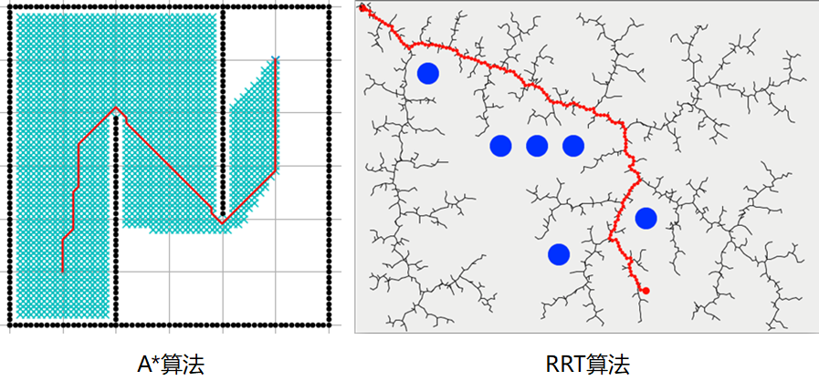

# 移动机器人的运动规划

Motion Planning for Mobile Robots

最近在学习移动机器人的运动规划，在学习的过程中做了一些记录和总结，便想着开一个专栏来分享一下

## 专栏介绍

一个移动机器人想要实现自主移动，需要有四个基础功能：

机器人要在一个位置环境中移动，首先需要知道自己的位置，这一步由**状态估计**(Estimation来完成；知道自身所处位置后，就需要对周围环境进行**感知**(Perception)，比如构建地图、使用激光雷达采集到的点云数据进行场景的三维重建等等；知道了机器人位置和周围环境情况，就可以进行**运动规划**(Planning)，即找到一条能让机器人安全地从A点移动到B点的运动轨迹，同时要满足机器人的运动学约束；最后由**控制**(Control)器产生控制信号(如PWM等)，控制机器人按照规划得到的运动轨迹进行移动。

本专栏主要内容将集中在**运动规划(Motion Planning)**环节上。在此之前可能都接触过或者听说过**路径规划(Path Planning)** 、**轨迹规划(Trajectory Planning)**这些名词，我们先理清它们和运动规划的联系和区别

先说说运动规划的基本要求：

- 安全性：移动过程中不能与周围环境发生碰撞
- 光滑性：减少机器人功耗、增加舒适度(如自动驾驶)
- 运动学可行性：不超出机器人速度、加速度等运动学参数范围

由这些基本要求，我们可以将**运动规划**拆解为**路径规划**和**轨迹规划**两部分，它们的关系图如下：

**路径规划**负责在**空间**上找到一条由起点到终点的**无碰撞**曲线，如下图：

在实际情况中只有这一条曲线是不够的，可以看到上图中两种路径规划算法得到的曲线都是相当曲折的，这不利于机器人的移动，所以我们还要考虑机器人要如何按照这条曲线进行移动，而**轨迹规划**则考虑到机器人位姿和运动学参数随**时间**变化的因素，对机器人的速度和加速度等进行规划，从而满足光滑性和运动学可行性等要求。

所以本专栏将围绕运动规划的两个组成来安排文章内容，主要内容包括：

- 路径生成算法(Path finding algorithm)

  这部分将分别对基于图搜索的算法(Dijkstra / A* / JPS等)、基于采样的算法(PRM / RRT / RRT* 等)、运动学约束下的路径规划算法(Kinodynamic RRT* / Hybrid A* 等)进行分析和讲解

- 轨迹生成/优化(Trajectory generation/optimization)

  这部分主要对Minimum-snap轨迹优化算法进行分析

以及每部分都会有的：

- 算法仿真(C#) 

在阅读之前，我希望你有如下的基础：

- 线性代数
- 概率论
- C#

## 文章目录

1. [Pre-requirement：地图的表示方法](./01-地图的表示.md)
2. [基于图搜索的路径规划算法：Dijkstra、A*](02-基于图搜索的路径规划算法.md)
3. [基于图搜索的路径规划算法：JPS](03-JPS算法.md)
4. 基于采样的路径规划算法：PRM、RRT、RRT* 
5. 运动学约束下的路径规划算法：Kinodynamic RRT* 、Hybrid A* 
6. [路径规划算法总结](./05-路径规划总结.md)
7. 轨迹生成算法：Minimum-snap
8. 软约束和硬约束下的轨迹优化

## 参考

[深蓝学院: Motion Planning for Mobile Robots](https://www.shenlanxueyuan.com/course/233)